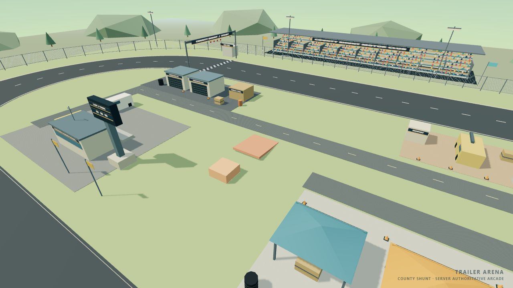

# Phase 6.2 — Infield ve tekerlek görselleri

27 Eylül 2026. Kod ve otomatik kontroller tamamlandı. Dış fence, grandstand, crowd ve motorsport görünümü korundu. Phase 7 başlatılmadı; reset, rebase veya commit yapılmadı. Aşağıdaki otomatik ve tarayıcı kontrolleri, kullanıcının A–I manuel sürüş kabulünün yerine geçmez.

1. **Infield neden boş görünüyordu?** Phase 6.1 operasyon alanı küçük bir kontrol/servis kümesine toplanmıştı. Geniş iç alanın çoğu tek çim yüzeydi; servis, takım ve recovery faaliyetleri arasında okunabilir bir düzen yoktu. Dekorlar client sunumuydu ve büyük objeler Rapier dünyasında temsil edilmiyordu.

2. **Yeni zone layout'u.** SERVICE kuzeybatıda iki garaj, depo ve servis malzemeleri; CONTROL güneybatıda kontrol binası, platform, kule ve destek araçları; PADDOCK güneydoğuda üç takım çadırı ve ekipmanları; RECOVERY kuzeydoğuda çekici, marshal booth ve recovery ekipmanı. ACCESS bölgesi bunları 4 metre genişliğinde çapraz servis yolu, batı/doğu girişleri ve takım erişim koluyla bağlar. Farklı tonlardaki asfalt, beton ve toprak pad'leri görsel amaçlıdır; yeni grip sistemi eklenmedi. Eski merkez rampası ve test bloğu korundu.

3. **Yeni objeler.** İki servis garajı, tool/fuel deposu, race control binası, anten, alçak platform, okunabilir timing board ve tabanı, maintenance van, safety pickup, recovery tow truck, iki takım ekipman trailer'ı, üç takım çadırı, dört lastik yığını, yakıt varili, ekipman kasaları, recovery beton bloğu, marshal booth, bayraklar ve küçük koniler. Servis araçları basit gövde, cam, tekerlek ve çekici koluyla temsil edilir. Toplam 158 shared görsel eleman var; bunların 13'ü tabela.

4. **Collision kapsamı.** 36 static collider: garajlar ve depo, kontrol binası/platformu, kule tabanı ve büyük timing board, beş park edilmiş araç/trailer gövdesi, dört lastik yığını, varil, beş ekipman kasası, recovery bloğu/booth ve çadırların 12 görünür sert direği. Küçük koniler, bayraklar, anten, ince yüzey detayları, tente kumaşı ve zemin boyaları görsel. Çadırın tamamını kapatan görünmez footprint yerine direkler collider taşıyor. Araçların girebileceği boş ön bölüm açık. Park edilmiş gövdeler hareket etmiyor.

5. **Client/server placement paylaşımı.** `packages/shared/src/constants/InfieldLayout.ts` id, zone, geometry, position, yaw, size ve collision alanlarını tanımlar. Client `InfieldEnvironment`, server `InfieldColliders` aynı `getInfieldTransform` sonucunu kullanır. Server cuboid/cylinder oluşturur; ayrı koordinat listesi yoktur. Gerçek Three.js instance matrisleri ile gerçek Rapier collider konum, quaternion ve boyutlarını karşılaştıran test geçti. Bina gövde footprint'leri eşleşiyor; on kenarlı lastik görseli ile yuvarlak collider farkı 3 cm altında. Ufak cam/tekerlek/bant detaylarının gövdeden birkaç santimetre çıkıntısı collider ayrıntısına dönüştürülmedi.

6. **Invisible collider kontrolü.** Collider haritasında yalnız `collision:true` elemanları bulunuyor; cosmetic elemanların hiçbiri ek collider üretmiyor. Araç boyutlu swept-shape testleri çapraz servis yolu, batı giriş, doğu giriş, paddock yolu ve çadır ön açıklığından engellenmeden geçti. Bütün yeni obstacle footprint'leri ovalin iç kenarından en az 25 cm içeride. Pist kenarına yeni bariyer eklenmedi. Beş obje türünde 6 ve 21 m/s araç testleri gerçek teması doğruladı; araçlar objenin karşısına geçmedi, y/vertical velocity sınırları içinde kaldı ve fren/reverse inputuyla en az 2 metre geri çıkabildi. Props RAM olayı üretmedi. Bu kontroller bütün olası çarpışma açılarını veya hava manevralarını kapsamaz.

7. **Infield performance.** Üç instanced primitive batch aynı material'ı paylaşır; 13 tabela tek atlas ve tek mesh kullanır. Infield ana geçişte dört draw call gerektirir. Aynı 1280×720, odasız başlangıç kamerasında Phase 6.1: 28 calls / 9.350 tris / yaklaşık 230 FPS; Phase 6.2: 31 calls / 13.328 tris / yaklaşık 239 FPS örneği. Draw call artışı 3; geometri ayrıntısı arttı. İki oyunculu durgun chase örneği 127 calls / 15.054 tris / yaklaşık 169–175 FPS. Kamera ve sekme odağı bu değerleri etkiler; uzun sürüş/sekiz oyuncu benchmark'ı yapılmadı. Her player'ın dört küçük jant çubuğu spin yönünü okunabilir kılar ve araç başına dört ana draw ekler.

8. **Wheel animation'daki gerçek problem.** Silindir mesh Z ekseninde yönlendirildikten sonra mesh'in kendi yerel X eksenine `rotateX` uygulanması, teker milini çevirmiyordu; tekerin yönelimi spin sırasında değişebiliyordu. Spin için ayrı bir mil pivot'u yoktu. Görsel steer, local inputu doğrudan izlemiyordu. Eski hesap zaten `forwardSpeed` kullanıyordu; dünya hızının büyüklüğünü kullanma hatası varmış gibi bir değişiklik yapılmadı. Ayrıca sabit teker yüksekliği suspension rest konumunu temsil etmiyordu.

9. **Yeni hierarchy.** Her teker `WheelSteerPivot → WheelSpinPivot → WheelMesh` düzeninde. Mesh'in silindir yönelimi bir kez sabitleniyor; steer parent ve spin child ayrı transform'lar. Önler local input ile steer ediyor; arka pivot'ların steer'i sıfır. Dört teker aynı spin fazını kullanıyor. Araç chassis transform'larını yazan mevcut prediction/interpolation yolu korundu.

10. **Spin axis.** Spin child'ın local X ekseni. Native silindir Y mili, mesh'teki sabit −π/2 Z dönüşüyle +X'e hizalanır. `omega = longitudinalSpeed / wheelRadius`; render dt ile entegre edilir. Hız 65 ms zaman sabitiyle hafif yumuşatılır, açı sarılır ve invalid/extreme değerler sonlu tutulur. Trailer üzerinde relativeForwardSpeed kullanılır; hareketli trailer'da duran otomobilin tekerleri dönmez.

11. **Steering axis.** Steer parent'ın local Y ekseni. A negatif, D pozitif görsel açı üretir; +Z araç ön yönü için sol/sağ konvansiyonu doğrudur. Local input World → VehicleManager → local VehicleView üzerinden yalnız görsele taşınır. Mevcut steeringStrength ve speed reduction değerleri okunur; physics steering değiştirilmez. Görsel steering smoothing 55 ms. Camber/toe eklenmedi.

12. **Reverse spin sonucu.** Pozitif/negatif hız çiftleri karşıt açısal yön üretti; −7, 0, 6 ve 21 m/s değerlerinde v/r doğrulandı. Reverse'de A/D görsel steer yönü aynı kaldı. Hız yönü değişiminde smoothing kısa sürede yeni yöne oturdu. Gerçek obje çarpışmalarından reverse ile çıkış testleri de geçti.

13. **Steering + spin sonucu.** 600 render frame boyunca gerçek wheel mesh dünya milinin steered X yönünde kaldığı doğrulandı. Sağ/sol spin aynı, parent X/Z ve child Y/Z sıfır; steer spin'i overwrite etmiyor. Durgun, ileri ve geri A/D testleri geçti. Zemine temas için merkez yüksekliği mevcut suspension rest length ve nominal statik yay sıkışmasından hesaplanıyor. Gerçek Rapier aracı düz zeminde yerleştiğinde dört görsel tekerin altı zeminin 3 cm toleransı içinde. Per-wheel suspension raycast verisi network'te olmadığından bu bir görsel yaklaşım; engebeli/rampa üzerindeki her teker için kesin contact reconstruction yapılmıyor.

14. **RAM slide wheel visual sonucu.** Aynı 3 m/s boyuna hızdaki normal araç ile 28 m/s lateral slide ve yaw içeren araç aynı spin fazını üretti. Lateral hız ve angular velocity spin hesabına girmez. RAM sistemine değişiklik yapılmadı; mevcut collision/slide/upright testleri geçti. İnsan tarafından RAM sonrası animasyon değerlendirmesi henüz yapılmadı.

15. **Remote wheel sonucu.** Remote snapshot'ın forward/relative forward hızından spin üretilir. Network steering alanı eklenmedi; remote ön tekerler nötr. Negatif remote hız ve yüksek yaw örneğinde reverse spin doğru, steer sıfır ve tek interpolation writer doğrulandı. İki tarayıcı aynı odaya katıldı; ready/countdown/playing akışı çalıştı. Üç kontrol sekmesinde console error/warning yoktu. İki insanın yan yana sürüşle remote wobble kabulü açık. Truck ve trailer görsellerinde mevcut wheel spin animasyonu bulunmadığından bu modeller değiştirilmedi.

16. **Prediction regression sonucu.** Phase 5.2 prediction/proxy, pending input, moving platform, reconciliation ve network kaynaklarının başlangıç SHA-256'ları aynı. Mevcut prediction testleri korundu ve geçti. Yeni input-routing testi Prediction ON/OFF halinde local steer'in doğru çalıştığını, remote steer'in nötr kaldığını ve chassis için 1 writer / 0 conflict olduğunu doğruladı. Canlı 0 ms ek latency oyununda da `PREDICTION · 1 writes · 0 conflicts`, eşleşen P/A konumu ve anlık 0.000 m position error görüldü. Bununla birlikte HUD'nin birikimli maximum error alanında 105,884–106,492 m değerleri görüldü; neden izole edilmedi. Bu istatistik nedeniyle canlı prediction'ın tüm koşullarda kusursuz olduğu iddia edilmiyor. Prediction kodunu değiştirmeden gözlem rapora kaydedildi.

17. **Physics regression sonucu.** VehicleTuning, VehicleController, ServerVehicle, spawner, suspension, reverse, RAM, recovery, convoy/trailer, scoring, round, SurfaceRegistry, CollisionGroups, WorldLayout ve track ölçüleri başlangıçla byte olarak aynı. PhysicsWorldBuilder yalnız yeni infield static collider'larını ekler; eski world box'ları/gravity korundu. Restitution 0,02, friction 0,8; mevcut ground surface sınıfı kullanılır. Yeni group veya RAM hedefi yoktur. Mevcut oval tur, steering, reverse, upright, player collision, convoy ve gameplay testleri geçti. Başlangıçtaki 95 dosyanın 88'i aynı; değişen yedi mevcut dosya PhysicsWorldBuilder, shared index, MotorsportEnvironment, VehicleView, VehicleManager, World ve genişletilen VehicleRendering testidir. MotorsportEnvironment içindeki addInfield dışındaki yöntemler aynı; ses kaynakları aynı.

18. **Toplam automated sonuç.** 16 test dosyasında **247/247 geçti**: client 89, server 158. Önceki 207 test korundu, bu patch için 40 test eklendi. `pnpm typecheck`, `pnpm build`, `pnpm test`, `pnpm lint`, `pnpm format:check` başarılı. Build'in 658 kB client chunk için mevcut Vite büyüklük uyarısı var; build başarılı. Yerleşim determinism, gerçek client/server transform/footprint eşleşmesi, collider kapsamı, açık yollar, 10 gerçek araç çarpışma/reverse senaryosu, wheel v/r/reverse/lateral/hierarchy/finite/smoothing/contact ve prediction writer routing kontrol edildi.

19. **Phase 7 öncesi blocker.** Otomatik kontrol kaynaklı başarısızlık yok. Tam Phase 6.2 kabulü için kullanıcının A–I testleri hâlâ gerekli: infield'e doğal sürüş, beş obje türüne farklı açılardan çarpma, açık yollardan geçiş, durgun A/D, ileri/geri spin, virajda steer+spin, RAM slide ve iki oyuncuyla remote gözlem. Canlı HUD maksimum prediction istatistiği de kabul sırasında yeniden gözlenmeli; sebebi doğrulanmış değildir. Phase 7'ye geçilmedi; çalışma burada durur. Commit alınmadı.

